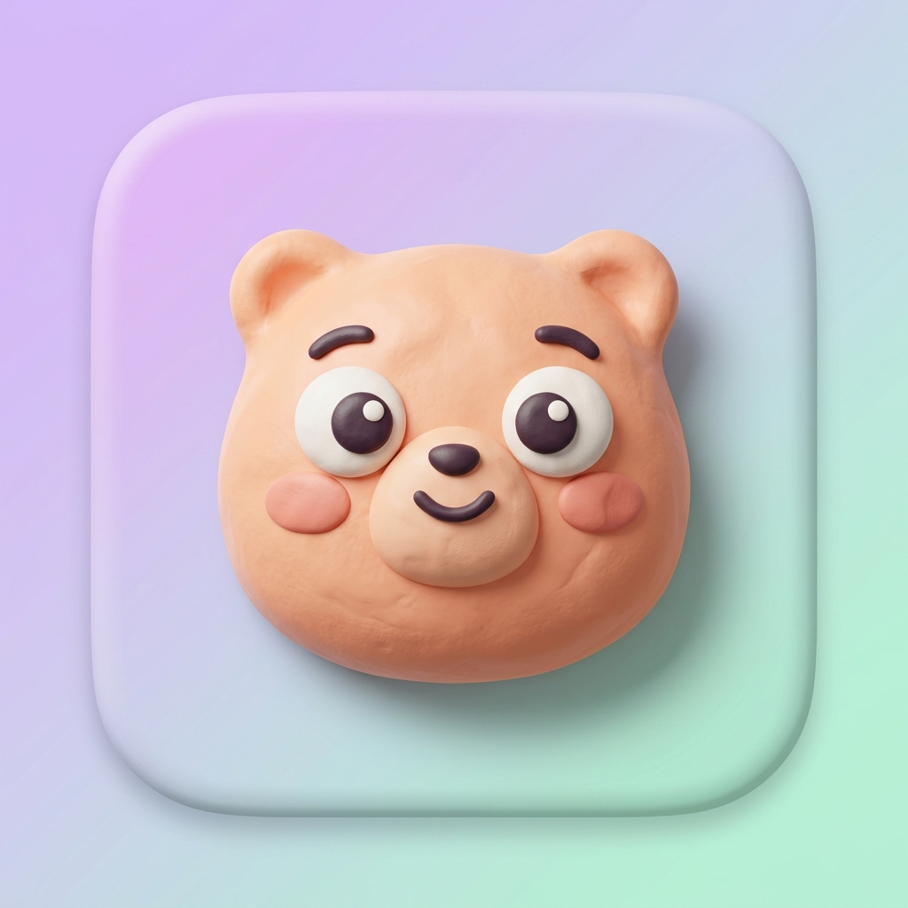
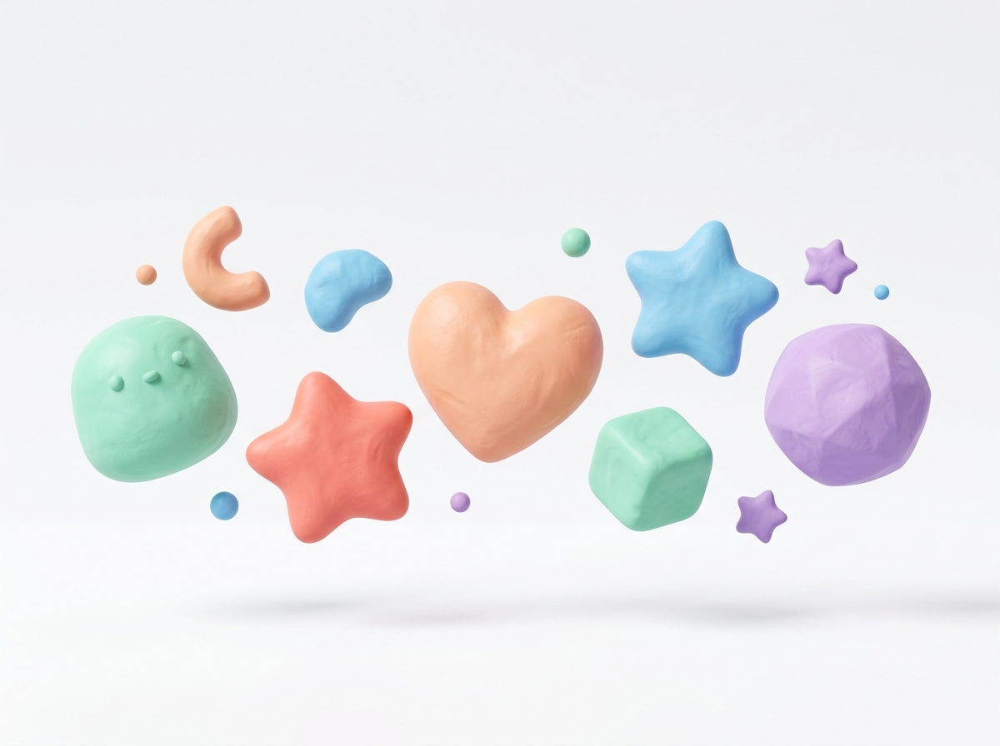

<div align="center">



# 🧸 Clayworld

### Platform kreatif dengan estetika **Claymorphism** yang lembut, berwarna, dan menyenangkan

[](https://claymorphism.vercel.app)
[](https://github.com/BayDKen/Claymorphism/stargazers)
[](LICENSE)


<br/>



</div>

---

## 📖 Tentang Proyek

**Clayworld** adalah sebuah landing page modern yang mengimplementasikan gaya desain **Claymorphism** — tren UI yang terinspirasi dari tampilan mainan clay 3D yang lembut, mengembung, dan penuh warna pastel.

Proyek ini dibangun menggunakan **pure HTML, CSS, dan Vanilla JavaScript** tanpa framework apapun, membuktikan bahwa desain premium tidak selalu membutuhkan tools yang kompleks.

> _"Membawa kesenangan dan kelembutan ke dunia desain digital."_

---

## ✨ Fitur Unggulan

### 🎨 Desain & Estetika
| Fitur | Deskripsi |
|-------|-----------|
| **Claymorphism Cards** | Kartu dengan multi-layer shadow, inset highlight, dan border-radius besar yang menciptakan efek clay 3D |
| **Pastel Color Palette** | Palet warna kurasi: Mint · Coral · Lavender · Peach · Sky Blue · Yellow |
| **Clay Assets** | 3 aset ilustrasi AI-generated: hero shapes, icon set, dan clay character |
| **Custom Favicon** | Icon browser multi-ukuran (16/32/48px ICO + PNG 192px + Apple Touch Icon 180px) |
| **Web Manifest** | Dukungan PWA dengan theme color dan icon homescreen |

### ⚡ Interaksi & Animasi
| Fitur | Deskripsi |
|-------|-----------|
| **Mouse Parallax** | Background blob bergerak mengikuti posisi kursor |
| **3D Card Tilt** | Kartu miring perspektif 3D saat di-hover menggunakan `perspective()` CSS |
| **Magnetic Buttons** | Tombol mengikuti gerakan kursor seperti efek magnet |
| **Float Animation** | Hero image melayang naik-turun dengan `@keyframes` smooth |
| **Scroll Reveal** | Elemen muncul bertahap saat di-scroll via `IntersectionObserver` |
| **Counter Animation** | Angka statistik count-up dengan easing cubic saat muncul di viewport |
| **Infinite Marquee** | Strip teks berjalan infinite, pause saat di-hover |
| **Scroll Parallax** | Hero image bergeser perlahan saat halaman di-scroll |

### 📱 Responsivitas
- Fully responsive: Desktop → Tablet → Mobile
- Hamburger menu animasi untuk layar kecil
- Layout grid yang adaptif dengan `auto-fill` dan `minmax()`
- Frosted glass navbar saat scroll

---

## 🗂️ Struktur Proyek

```
Claymorphism/
│
├── 📄 index.html              # Halaman utama HTML
├── 🎨 style.css               # Design system & semua styling
├── ⚡ script.js               # Interaksi & animasi JavaScript
│
├── 🔧 vercel.json             # Konfigurasi deployment Vercel
├── 📱 site.webmanifest        # Web App Manifest (PWA)
├── 🖼️  favicon.ico            # Icon browser (multi-size: 16/32/48px)
│
└── 📁 assets/
    ├── 🖼️  clay_hero.jpg          # Ilustrasi floating clay shapes (hero section)
    ├── 🧸 clay_character.jpg     # Clay mascot character
    ├── 💻 clay_icons.jpg          # Clay icon set (laptop, phone, star, shield)
    ├── 🖼️  icon-512.jpg           # App icon full resolution (512×512)
    ├── 🖼️  icon-192.png           # PWA icon (192×192)
    ├── 📱 apple-touch-icon.png   # iOS homescreen icon (180×180)
    └── 🖼️  favicon-32.png         # Favicon PNG (32×32)
```

---

## 🛠️ Tech Stack

```
┌─────────────────────────────────────────────────────┐
│  🏗️  HTML5          — Struktur semantik halaman      │
│  🎨  CSS3           — Design system & animasi        │
│  ⚡  Vanilla JS     — Interaksi tanpa framework      │
│  🔤  Google Fonts   — Nunito + Outfit typefaces      │
│  🚀  Vercel         — Hosting & deployment           │
└─────────────────────────────────────────────────────┘
```

**CSS Highlights:**
- Custom Properties (CSS Variables) untuk design tokens
- `IntersectionObserver` API untuk scroll-triggered animations
- `perspective()` + `rotateX/Y()` untuk efek 3D tilt
- `@keyframes` untuk float, marquee, dan fade animations
- `backdrop-filter: blur()` untuk frosted glass effect

---

## 🚀 How To Run Locally

### Prasyarat
Tidak ada dependensi atau instalasi yang dibutuhkan! Cukup browser modern.

### Langkah 1 — Clone Repository

```bash
git clone https://github.com/BayDKen/Claymorphism.git
cd Claymorphism
```

### Langkah 2 — Buka di Browser

**Cara termudah:** Klik dua kali file `index.html`

**Atau gunakan Live Server (VS Code):**
1. Install ekstensi [Live Server](https://marketplace.visualstudio.com/items?itemName=ritwickdey.LiveServer) di VS Code
2. Klik kanan `index.html` → **"Open with Live Server"**
3. Browser akan terbuka otomatis di `http://127.0.0.1:5500`

**Atau gunakan Python HTTP Server:**
```bash
# Python 3
python -m http.server 8000

# Buka browser → http://localhost:8000
```

**Atau gunakan Node.js:**
```bash
npx serve .

# Buka browser → http://localhost:3000
```

---

## ☁️ How To Deploy ke Vercel

### Opsi A — Drag & Drop (Termudah, tanpa akun GitHub)

1. Buka [vercel.com/new](https://vercel.com/new)
2. Drag & drop seluruh folder `Claymorphism/` ke halaman tersebut
3. Klik **Deploy**
4. ✅ Selesai! Website live dalam ~30 detik

### Opsi B — Import dari GitHub (Recommended)

1. Fork atau clone repo ini ke akun GitHub kamu
2. Buka [vercel.com/new](https://vercel.com/new)
3. Klik **"Import Git Repository"**
4. Pilih repo **`Claymorphism`**
5. Biarkan semua setting default (Framework: **Other**, Root Directory: `./`)
6. Klik **Deploy**

> 💡 **Auto-deploy aktif!** Setiap kali kamu push ke branch `main`, Vercel otomatis re-deploy.

### Opsi C — Via Vercel CLI

```bash
# Install Vercel CLI
npm install -g vercel

# Login ke akun Vercel
vercel login

# Deploy dari folder proyek
cd Claymorphism
vercel

# Ikuti prompt, lalu kunjungi URL yang diberikan
```

---

## 🏗️ Cara Kustomisasi

### Mengubah Warna Tema

Edit CSS variables di bagian `:root` dalam `style.css`:

```css
:root {
  --mint:     hsl(160, 68%, 78%);   /* Ubah hue untuk warna berbeda */
  --coral:    hsl(10,  88%, 78%);
  --lavender: hsl(268, 72%, 82%);
  --peach:    hsl(28,  90%, 80%);
  --sky:      hsl(205, 80%, 80%);
}
```

### Mengganti Konten Teks

Semua teks tersedia langsung di `index.html`. Cari section yang ingin diubah:

```html
<!-- Hero Section -->
<h1 class="hero-title">Desain yang <span class="accent-text">Terasa Nyata</span></h1>

<!-- Stats -->
<span class="stat-number">12K+</span>
<span class="stat-label">Pengguna Aktif</span>
```

### Menambah Feature Card

Copy-paste struktur berikut ke dalam `.features-grid` di `index.html`:

```html
<div class="clay-card feature-card">
  <div class="feature-icon-wrap" style="background: hsl(200, 90%, 88%);">
    <span class="feat-emoji">🎯</span>
  </div>
  <h3 class="feature-title">Judul Fitur</h3>
  <p class="feature-desc">Deskripsi fitur kamu di sini.</p>
  <div class="feature-tag">Tag Label</div>
</div>
```

---

## 🎭 Design System

### Claymorphism Formula

Clay cards dibuat dengan kombinasi tiga properti kunci:

```css
.clay-card {
  border-radius: 32px;                    /* 1. Sudut sangat membulat */
  box-shadow:
    0 8px 32px hsla(230,25%,30%,0.12),   /* 2. Soft drop shadow */
    0 3px 10px hsla(230,25%,30%,0.08),
    inset 0 1px 0 hsla(0,0%,100%,0.85); /* 3. Inset highlight (kunci clay!) */
}

.clay-card::before {
  /* 4. Gradient overlay untuk kesan 3D */
  background: linear-gradient(145deg,
    hsla(0,0%,100%,0.55) 0%,
    hsla(0,0%,100%,0) 60%
  );
}
```

### Tipografi

| Penggunaan | Font | Weight |
|------------|------|--------|
| Heading, Logo, Badge | **Nunito** | 700, 800, 900 |
| Body, Deskripsi | **Outfit** | 400, 500, 600 |

---

## 📸 Preview Sections

| Section | Deskripsi |
|---------|-----------|
| **Navbar** | Sticky navbar dengan frosted glass effect saat scroll |
| **Hero** | Full-height dengan floating image, stats counter, dan parallax blobs |
| **Marquee** | Strip ticker infinite scroll dengan 8 kategori |
| **Features** | Grid 6 kartu clay dengan ikon dan hover tilt |
| **Gallery** | Grid foto dengan overlay reveal saat hover |
| **Testimonials** | 3 review card dengan clay mascot |
| **CTA** | Call-to-action dengan gradient clay background |
| **Footer** | Multi-column dengan branding |

---

## 📄 Lisensi

Proyek ini dirilis di bawah lisensi **MIT** — bebas digunakan untuk keperluan personal maupun komersial.

```
MIT License © 2026 BayDKen
```

---

## 🙏 Acknowledgements

- Font: [Google Fonts](https://fonts.google.com) — Nunito & Outfit
- Hosting: [Vercel](https://vercel.com)
- Aset ilustrasi: AI-generated dengan gaya Claymorphism
- Inspirasi desain: Tren UI/UX Claymorphism 2024–2026

---

<div align="center">

Dibuat dengan 🧸 dan ☕ oleh **[BayDKen](https://github.com/BayDKen)**

⭐ **Star repo ini jika kamu suka!** ⭐

</div>
